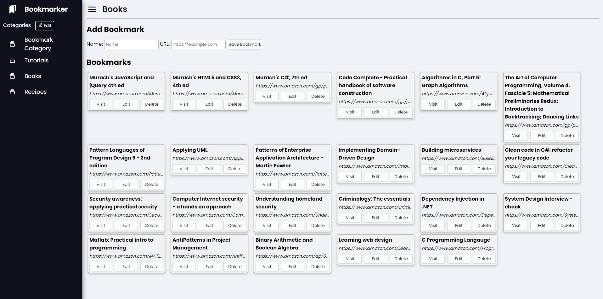
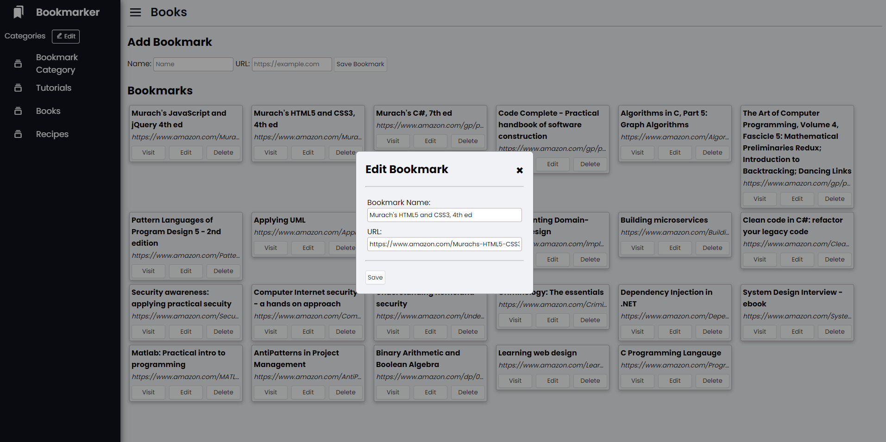
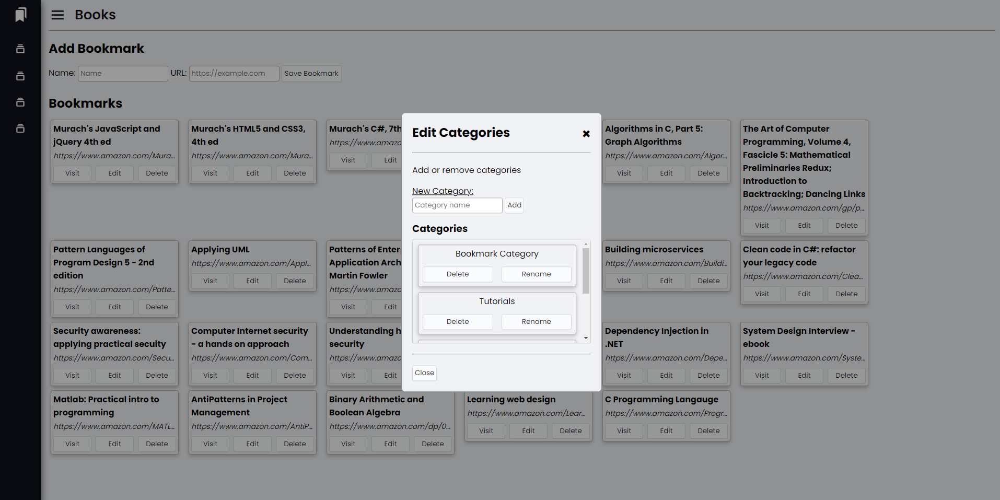

# bookmarker
Bookmark website as a final project for my CIS435 Web Tech course during the Fall 2021 semester (currently finishing), and allows adding a bookmark with a name and URL.

Utilizes HTMl, CSS, Javascript, PHP, and MySQL/MariaDB using phpMyAdmin with XAMPP

# Steps to Run

1) Download/Install XAMPP: https://www.apachefriends.org/download.html
2) Run XAMPP and select Start on the 'Apache' & 'MySQL' modules
3) Navigate in a browser to localhost/phpmyadmin
4) To create the database schema, within phpMyAdmin, select 'Import' on the top toolbar
5) Select 'Choose File' and navigate to 'createdatabase.sql' in bookmarker/scripts/database
6) Select Go
7) Place 'bookmarker' folder within a new folder inside C:\xampp\htdocs
8) In a browser, navigate to localhost/{foldername}/bookmarker

If successful, it should load a couple default categories and show no errors in the console output within Inspect Element

# Screenshots
A few screenshots of the current state of the project

